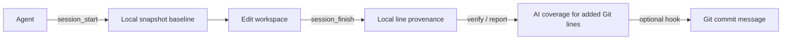

# ai-code-provenance

[](https://github.com/Crish07/ai-code-provenance/actions/workflows/ci.yml)
[](https://github.com/Crish07/ai-code-provenance/actions/workflows/release.yml)
[](LICENSE)

> Local, auditable AI code provenance for MCP coding agents.

ai-prov captures a workspace baseline before an Agent edits, computes the real changes when it finishes, and reports **AI source coverage** for added effective Git lines. Source code, diffs, snapshots, and SQLite data stay local; ai-prov does not upload them.

[Repository](https://github.com/Crish07/ai-code-provenance) · [Releases](https://github.com/Crish07/ai-code-provenance/releases) · [Issues](https://github.com/Crish07/ai-code-provenance/issues) · [中文说明](README.zh.md)

**Quick navigation:** [Why ai-prov](#why-ai-prov) · [How it works](#how-it-works) · [Start in 60 seconds](#start-in-60-seconds) · [CLI reference](#complete-cli-reference) · [Contributing](#contributing) · [Security](#security)

## Why ai-prov

- **Turn Agent work into inspectable local records.** A session has an explicit edit baseline and completion record.
- **See coverage for added Git lines.** `verify` and `report` compare local provenance with staged or worktree Git diffs.
- **Keep project data local by default.** Provenance, snapshots, and the database live in `.ai-provenance/`, which should remain Git-ignored.
- **Fit into existing workflows.** Use the stdio MCP server, copyable Agent Rules, an optional Git `commit-msg` hook, and macOS/Linux/Windows Release archives.

## How it works



Only a successfully finished session writes provenance. Unrecorded lines, edits whose source cannot be carried forward, and failed sessions are never labelled as AI.

## Start in 60 seconds

### 1. Install

Download the archive for your operating system and architecture from [Releases](https://github.com/Crish07/ai-code-provenance/releases), verify `SHA256SUMS.txt`, extract it, and enter the extracted directory:

```sh
# macOS / Linux
./ai-prov install
```

```powershell
# Windows PowerShell
# Windows does not always define HOME; set it for this PowerShell session before installing.
if (-not $env:HOME) {
  $env:HOME = $env:USERPROFILE
}
.\ai-prov.exe install
```

> Windows installation troubleshooting: if `install` reports `home directory is required`, run the `HOME` setup above and retry. It affects only the current PowerShell session and does not change system or user environment variables. Also ensure that `LOCALAPPDATA` is defined. If `ai-prov` is still not recognised in a new terminal after installation, verify it with its full path first:
>
> ```powershell
> $exe = Join-Path $env:LOCALAPPDATA 'Programs\ai-prov\ai-prov.exe'
> & $exe init
> ```

`install` copies `ai-prov` and `ai-prov-mcp` for the current user and adds only an ai-prov-owned PATH entry. Open a new terminal after PATH changes.

### 2. Initialize a project

```sh
cd <your Git project>
ai-prov init
```

All project-local state is stored in `.ai-provenance/`; ignore that directory in the project `.gitignore`. `init` also creates `.ai-provenance/.ai-provenanceignore`, the ai-prov-specific workspace-ignore file, so no extra file is added at the project root.

### 3. Connect your Agent

Configure `ai-prov-mcp` as a local stdio MCP server, then copy the template for your Agent from the Release `rules/` directory into the location that Agent actually loads. MCP configuration formats differ by Host, so follow the [Rules setup guide](rules/README.md) instead of guessing configuration fields.

For each task, the Agent should follow: `session_recover → session_start → edit → session_finish`. After context compaction, recover with the persisted `agent_instance_id`; never guess a session ID.

### 4. Verify or add commit metadata (optional)

```sh
# Check AI source coverage for staged added lines.
ai-prov verify --scope staged --strict

# Install the commit-message hook in the current Git project.
ai-prov hook install
```

By default, the hook adds `[AI:<n>%]` to the commit subject and appends `AI-Lines` and `AI-Agent`. It manages only its own content and refuses to overwrite another tool's hook directly.

### Workspace ignore rules

`session_start` and `session_finish` read both the existing root `.gitignore` and `.ai-provenance/.ai-provenanceignore`. They use a line-oriented, last-match-wins Git-style subset: blank lines, `#` comments, `!` negation, `*`, `?`, `[]`, `**`, root-relative paths, and recursive directory rules ending in `/` are supported.

For example, this rule prevents all GitNexus analysis cache files from entering a snapshot or finish diff:

```gitignore
.gitnexus/
```

`.gitnexus/` is also an internally skipped directory. Use the dedicated file only for non-product content such as caches and build outputs; never exclude source, tests, configuration, or product documentation to bypass provenance. Nested `.gitignore` files, Git attributes, and escaped trailing-space semantics are not implemented.

## What coverage means

AI source coverage is only the proportion of **added effective staged/worktree lines** that match completed AI provenance. It is not token, cost, conversation-turn, duration, authorship, or complete line-identity verification.

```text
Added effective lines: 5
Lines matching AI provenance: 5
AI source coverage: 100%
```

## Complete CLI reference

Except for `install`, `uninstall`, `version`, and `completion`, project commands must be run from a project root where `ai-prov init` has completed. Append `--help` to any command to view the exact options supported by your installed version.

### Initialization, status, and version

| Command                                       | Purpose and notes                                                                                                                                                                                                                            |
| --------------------------------------------- | -------------------------------------------------------------------------------------------------------------------------------------------------------------------------------------------------------------------------------------------- |
| `ai-prov init`                                | Initializes `.ai-provenance/`, default configuration, the SQLite database, the snapshot directory, and the dedicated `.ai-provenanceignore` file. It is safe to run again, never uploads code, and does not overwrite existing ignore rules. |
| `ai-prov status`                              | Prints the absolute project path and counts of `active`, `finished`, and `failed` sessions. Use it to confirm the project is usable.                                                                                                         |
| `ai-prov version`                             | Prints the CLI version, commit, and build time. Run it first when checking that Rules, MCP, and binaries are from the same version.                                                                                                          |
| `ai-prov --help` / `ai-prov <command> --help` | Lists commands or subcommands and their flags; this is the authoritative entry point for discovering capabilities actually available locally.                                                                                                |

### Session and snapshot management

| Command                                  | Purpose and notes                                                                                                                                                                                                     |
| ---------------------------------------- | --------------------------------------------------------------------------------------------------------------------------------------------------------------------------------------------------------------------- |
| `ai-prov sessions active`                | Lists active sessions without reading or printing source content. Each line contains the session ID, start time, Agent, task, file count, and snapshot bytes.                                                         |
| `ai-prov sessions active --json`         | Serializes the active-session list as JSON for scripts; it does not include source content.                                                                                                                           |
| `ai-prov snapshots gc`                   | **Dry-run by default**: previews reclaimable sessions, objects, and bytes that exceed terminal-snapshot retention. It deletes nothing.                                                                                |
| `ai-prov snapshots gc --older-than 168h` | Temporarily overrides configured terminal-snapshot retention; `168h` means seven days. This flag does not modify the configuration file.                                                                              |
| `ai-prov snapshots gc --json`            | Serializes the GC preview or apply result as JSON.                                                                                                                                                                    |
| `ai-prov snapshots gc --apply`           | Deletes terminal snapshot/object candidates selected by the current criteria. This is destructive: first run the command without `--apply` and review the scope. It can be combined with `--older-than` and `--json`. |

Automatic reclaim policy: the first `session_start` for each project each day checks reclaimable snapshots. Snapshots for completed sessions are retained for seven days by default; snapshots for sessions that failed because their lease expired also become reclaimable after seven days. Snapshots of active sessions are never automatically deleted. The default session lease is 24 hours for overnight recovery, and normal tasks do not need heartbeats. Normal CLI GC always defaults to dry-run and can be used to preview or reclaim earlier manually.

### Coverage verification and serialized report output

`verify` produces summary statistics. On top of the same statistics, `report` labels every added line as AI or unknown and lists files skipped by the workspace scan. Both operate only on the local Git diff and local provenance data; neither uploads anything.

| Command                           | Purpose and notes                                                                                                                                                                                                  |
| --------------------------------- | ------------------------------------------------------------------------------------------------------------------------------------------------------------------------------------------------------------------ |
| `ai-prov verify`                  | Checks whether added lines in the staged diff (the default `staged` scope) are covered by completed AI sessions. It prints coverage, referenced sessions, and uncovered files. Any non-`ok` result exits non-zero. |
| `ai-prov verify --scope worktree` | Verifies working-tree changes relative to Git. `--scope` accepts only `staged` or `worktree`.                                                                                                                      |
| `ai-prov verify --strict`         | Strict mode fails when any added line is uncovered; use it for CI or a pre-commit gate.                                                                                                                            |
| `ai-prov verify --json`           | Writes JSON summary fields identical to MCP `provenance.verify` to standard output.                                                                                                                                |
| `ai-prov report`                  | Prints a per-file, per-line attribution (`AI` or `unknown`) for added lines and skipped workspace items. The default scope is `staged`. This is CLI-only; MCP has no `report` tool.                                |
| `ai-prov report --scope worktree` | Produces the per-line report from working-tree changes.                                                                                                                                                            |
| `ai-prov report --json`           | Writes the complete JSON report—statistics, line text, and skipped items—to standard output. It **does not create a report file automatically**.                                                                   |

Save a report with shell redirection:

```sh
# Staged report: write JSON in the current directory.
ai-prov report --json > ai-prov-report.json

# Working-tree report: also write JSON.
ai-prov report --scope worktree --json > ai-prov-report-worktree.json

# View human-readable per-line output without saving it.
ai-prov report --scope staged
```

`report --json` has the following fields. `files[].added_lines[].content` contains the real added-line text, so a report may contain source code; review it before saving, uploading, or sharing it.

```jsonc
{
  "status": "ok", // ok or warning
  "scope": "staged", // staged or worktree
  "total_added_lines": 5, // all added effective lines
  "ai_added_lines": 5, // added lines matching AI provenance
  "untracked_added_lines": 0, // added lines not matching provenance
  "coverage": 1, // AI source coverage, from 0 to 1
  "sessions": ["<session-uuid>"], // completed sessions used in this result
  "uncovered_files": [], // paths that contain unknown added lines
  "files": [
    {
      "path": "internal/example.go", // project-relative path
      "added_lines": [
        {
          "content": "func Example() {}", // added-line text; may be source code
          "source": "AI", // AI or unknown
          "session_id": "<session-uuid>", // present only for AI lines
        },
      ],
    },
  ],
  "skipped": [
    {
      "path": "assets/logo.png", // path excluded from workspace scan
      "reason": "non_utf8_or_binary", // skip reason, such as binary or non-UTF-8
    },
  ],
}
```

### Installation and removal

| Command                                                        | Purpose and notes                                                                                                                                                                        |
| -------------------------------------------------------------- | ---------------------------------------------------------------------------------------------------------------------------------------------------------------------------------------- |
| `./ai-prov install` (macOS/Linux Release extraction directory) | First-install entry point. Copies the release `ai-prov` and `ai-prov-mcp` into the user-level directory and adds an ai-prov-owned PATH fragment. On Windows use `.\ai-prov.exe install`. |
| `ai-prov install --dry-run`                                    | Validates release binaries and target paths only; it does not copy files, alter PATH, or write an installation receipt.                                                                  |
| `ai-prov install --dir /absolute/path`                         | Overrides the user-level installation directory. Use only an absolute path you own.                                                                                                      |
| `ai-prov install --no-path`                                    | Installs binaries without changing the shell profile or Windows user PATH; afterwards use absolute paths or manage PATH yourself.                                                        |
| `ai-prov install --force`                                      | Replaces differing ai-prov-managed target binaries only. It does not affect project provenance data.                                                                                     |
| `ai-prov uninstall --dry-run`                                  | Previews receipt-listed binaries whose SHA-256 still matches and the ai-prov PATH fragment; it deletes nothing.                                                                          |
| `ai-prov uninstall`                                            | Removes only receipt-owned, hash-matching binaries and the ai-prov-owned PATH entry. It never removes `.ai-provenance`, MCP configuration, Rules, or Git hooks.                          |
| `ai-prov uninstall --keep-path`                                | Removes binaries but retains the recorded ai-prov PATH entry.                                                                                                                            |

### Git Hook and trailers

| Command                                                           | Purpose and notes                                                                                                                                                                                                                                |
| ----------------------------------------------------------------- | ------------------------------------------------------------------------------------------------------------------------------------------------------------------------------------------------------------------------------------------------ |
| `ai-prov hook install`                                            | Installs a `commit-msg` hook and enables title coverage mode: it adds `[AI:<n>%]` to the subject and writes `lines,agent` trailers. It refuses to overwrite a non-ai-prov hook.                                                                  |
| `ai-prov hook install --force`                                    | Backs up an existing `commit-msg` hook before installing ai-prov's hook; use only when that backup is acceptable.                                                                                                                                |
| `ai-prov hook install --trailer-only`                             | Installs the hook without changing the subject; the default trailer fields become `coverage,lines,agent`.                                                                                                                                        |
| `ai-prov hook uninstall`                                          | Removes only the hook managed by ai-prov; foreign hooks are preserved or restored from backup.                                                                                                                                                   |
| `ai-prov hook config show`                                        | Shows effective trailer fields and the comment switch, with field descriptions.                                                                                                                                                                  |
| `ai-prov hook config set --fields coverage,agent --comments=true` | Sets trailer fields and, only when explicitly requested, writes the `# ai-prov trailer` comment. The default is `false`. Valid fields are only `coverage`, `lines`, `agent`, and `provenance-id`; provide comma-separated, non-duplicate values. |
| `ai-prov hook config reset`                                       | Restores title coverage mode and the `lines,agent` trailer fields, with the marker comment disabled.                                                                                                                                             |

`hook config set --fields ...` changes only the trailing fields; it does not change title coverage mode. `lines` displays recorded AI-added lines over all added lines; `provenance-id` displays the first eight characters of a contributing session ID. ai-prov has no verifiable confidence algorithm, so it does not emit `AI-Confidence`.

### Diagnostics and shell completion

| Command                                                        | Purpose and notes                                                                                                                                                                                                |
| -------------------------------------------------------------- | ---------------------------------------------------------------------------------------------------------------------------------------------------------------------------------------------------------------- |
| `ai-prov debug bundle`                                         | Creates a privacy-safe diagnostic ZIP in the current directory and prints its path. It includes runtime metadata only—never source code, diffs, databases, snapshots, tokens, credentials, or Git configuration. |
| `ai-prov debug bundle --output /absolute/path/diagnostics.zip` | Selects the diagnostic ZIP output path. The name must end in `.zip`, and the target must not already exist.                                                                                                      |
| `ai-prov completion bash` / `zsh` / `fish` / `powershell`      | Outputs the completion script for the specified shell. Follow the loading steps printed by `ai-prov completion <shell> --help`.                                                                                  |
| `ai-prov completion <shell> --no-descriptions`                 | Generates a completion script without command descriptions, useful when a smaller script is preferred.                                                                                                           |

## Optional Git trailers

`ai-prov hook install` installs a project `commit-msg` hook. By default it writes verified coverage in the subject and concise audit data at the end:

```text
feat: add thing [AI:100%]

AI-Lines: 5/5
AI-Agent: codex
```

Use `ai-prov hook install --trailer-only` to leave the subject unchanged and write `AI-Contribution`, `AI-Lines`, and `AI-Agent` at the end instead. `ai-prov hook config set --fields ...` controls only the ending trailer fields. The marker comment is off by default; set `--comments=true` only when you explicitly need it. `AI-Confidence` is not emitted because ai-prov has no verifiable confidence calculation. `hook.write_trailer: false` still removes stale ai-prov trailers when the hook runs and preserves unrelated Git trailers.

## MCP tools

| Tool                           | Purpose                                                         |
| ------------------------------ | --------------------------------------------------------------- |
| `provenance.session_start`     | Create a baseline session.                                      |
| `provenance.session_heartbeat` | Renew the owning instance's active-session lease.               |
| `provenance.session_recover`   | Recover exactly one active session, optionally for an instance. |
| `provenance.session_finish`    | Persist a local diff and line provenance.                       |
| `provenance.session_abandon`   | Mark a confirmed active session failed.                         |
| `provenance.session_status`    | Read persisted state without source access.                     |
| `provenance.verify`            | Verify staged/worktree added-line coverage.                     |
| `provenance.support`           | Return repository and issue-report URL.                         |

## Contributing

Read [CONTRIBUTING.md](CONTRIBUTING.md) before opening a pull request. The repository includes CI, a pull-request template, CODEOWNERS review, and an Issue template for reproducible bugs.

## Security

Read [SECURITY.md](SECURITY.md) before reporting a vulnerability. Do not post secrets, source snapshots, provenance data, databases, or private project paths in public Issues or pull requests.

## Development

```sh
gofmt -w <changed-go-files>
go test ./...
go test -race ./...
go vet ./...
go build ./cmd/ai-prov ./cmd/ai-prov-mcp
```

## License

[MIT](LICENSE)
