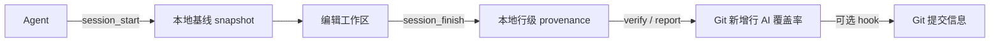

# ai-code-provenance

[](https://github.com/Crish07/ai-code-provenance/actions/workflows/ci.yml)
[](https://github.com/Crish07/ai-code-provenance/actions/workflows/release.yml)
[](LICENSE)

> 为 MCP Coding Agent 提供本地、可审计的 AI 代码来源记录。

ai-prov 在 Agent 编辑前建立工作区基线，在完成时计算真实变更，并为 Git 新增有效行计算 **AI 来源覆盖率**。源码、Diff、snapshot 和 SQLite 数据始终留在本地，不会由 ai-prov 上传。

[代码仓库](https://github.com/Crish07/ai-code-provenance) · [下载 Release](https://github.com/Crish07/ai-code-provenance/releases) · [提交 Issue](https://github.com/Crish07/ai-code-provenance/issues) · [English](README.md)

**快速导航：** [为什么使用](#为什么使用) · [工作方式](#工作方式) · [60 秒开始](#60-秒开始) · [命令参考](#cli-完整命令参考) · [参与贡献](#参与贡献) · [安全报告](#安全报告)

## 为什么使用

- **将 Agent 的改动变成可核对的本地记录**：一个 session 对应一次明确的编辑基线与结束记录。
- **看见 Git 新增行的覆盖率**：`verify` 与 `report` 将本地 provenance 和 staged/worktree Git diff 对照。
- **默认不上传项目数据**：provenance、快照和数据库保存在 `.ai-provenance/`，应保持 Git ignore。
- **接入已有工作流**：提供 stdio MCP、可复制的 Agent Rules、可选 Git `commit-msg` hook，以及 macOS/Linux/Windows Release 包。

## 工作方式



只有成功完成的 session 才会写入 provenance。未记录、人工修改后无法继承或 session 失败的行，都不会被标记为 AI。

## 60 秒开始

### 1. 安装

从 [Release](https://github.com/Crish07/ai-code-provenance/releases) 下载对应系统和架构的压缩包，校验 `SHA256SUMS.txt`，解压后进入目录：

```sh
# macOS / Linux
./ai-prov install
```

```powershell
# Windows PowerShell
# Windows 默认可能没有 HOME；当前版本安装前为本次 PowerShell 会话设置它。
if (-not $env:HOME) {
  $env:HOME = $env:USERPROFILE
}
.\ai-prov.exe install
```

> Windows 安装排错：若 `install` 提示 `home directory is required`，请先执行上面的 `HOME` 设置再重试。这只影响当前 PowerShell 会话，不会修改系统或用户环境变量；同时请确认 `LOCALAPPDATA` 已设置。安装完成后，若新终端中的 `ai-prov` 仍未被识别，可先使用完整路径验证：
>
> ```powershell
> $exe = Join-Path $env:LOCALAPPDATA 'Programs\ai-prov\ai-prov.exe'
> & $exe init
> ```

`install` 仅为当前用户复制 `ai-prov`、`ai-prov-mcp` 并添加 ai-prov 自有 PATH 项。PATH 变更后请新开终端。

### 2. 初始化项目

```sh
cd <你的 Git 项目>
ai-prov init
```

项目状态存于 `.ai-provenance/`，请在项目 `.gitignore` 中忽略该目录。`init` 还会在其中创建 `.ai-provenance/.ai-provenanceignore`；这是 ai-prov 专用的工作区忽略规则文件，不会在项目根目录新增文件。

### 3. 接入 Agent

将 `ai-prov-mcp` 配置为本地 stdio MCP server，并从 Release `rules/` 中选择与你的 Agent 对应的模板复制到其实际自动加载的位置。不同 Host 的 MCP 配置格式不同，因此请按 [Rules 配置说明](rules/README.zh.md) 操作，不要猜测配置字段。

Agent 每次任务应遵循：`session_recover → session_start → 编辑 → session_finish`。上下文压缩后用保存的 `agent_instance_id` 执行 `session_recover`，不要猜测 session ID。

### 4. 验证或写入提交信息（可选）

```sh
# 查看暂存区新增行的 AI 来源覆盖率
ai-prov verify --scope staged --strict

# 为当前 Git 项目安装提交信息 hook
ai-prov hook install
```

默认 hook 会在提交标题加入 `[AI:<n>%]`，并在消息末尾追加 `AI-Lines`、`AI-Agent`。它只管理自己写入的内容，遇到其他工具的 hook 时会拒绝直接覆盖。

### 工作区忽略规则

`session_start` 与 `session_finish` 同时读取项目根目录现有的 `.gitignore`，以及 `.ai-provenance/.ai-provenanceignore`。两者使用按行、后匹配优先的 Git 风格规则子集：支持空行、`#` 注释、`!` 反向规则、`*`、`?`、`[]`、`**`、根目录相对路径，以及以 `/` 结尾的递归目录规则。`init` 仅自动写入 `.git/` 与 `.ai-provenance/` 两条默认目录规则。

例如，下面的规则会使 `.gitnexus` 的全部分析缓存不参与 snapshot 或 finish Diff：

```gitignore
.gitnexus/
```

`.ai-provenance/.ai-provenanceignore` 用于按项目扩展：需要时请由用户自行加入 `.gitnexus/`、`node_modules/` 等缓存/依赖规则。`.git/` 与 `.ai-provenance/` 即使被从文件移除，仍是不可取消的安全边界。专用规则只应用于缓存、构建产物等非业务内容；不得用它排除源码、测试、配置或产品文档来规避 provenance。当前不读取嵌套 `.gitignore`、Git attributes，也不实现转义尾随空格语义。

## 覆盖率代表什么

AI 来源覆盖率只表示 staged/worktree **新增有效行**中，匹配已完成 AI provenance 的比例。它不表示 token、费用、对话轮数、耗时、作者身份，也不是完整行身份验证。

```text
新增有效行：5
已匹配 AI provenance：5
AI 来源覆盖率：100%
```

## 项目配置 `config.yaml`

`ai-prov init` 会在 `.ai-provenance/config.yaml` 写入下列项目级默认配置。所有容量均以字节表示；所有时长分别以小时或分钟表示。配置文件使用严格字段校验：未知字段、错误类型、非正数限制值或不支持的 `schema_version` 都会使项目配置无法加载。

```yaml
schema_version: 1
max_file_bytes: 5242880
strict_verify: false
snapshot_retention_hours: 168
snapshot_max_bytes: 1073741824
lease_timeout_minutes: 1440
max_active_per_agent_instance: 1
expired_session_grace_hours: 168
auto_reclaim_expired_sessions: true
snapshot_auto_gc_interval_hours: 24
```

| 字段 | 默认值 | 作用与边界 |
| --- | ---: | --- |
| `schema_version` | `1` | 当前唯一支持的配置格式版本；不要手动改为其他值。 |
| `max_file_bytes` | `5242880`（5 MiB） | 单个工作区文本文件可进入 snapshot/finish 扫描的最大大小；更大的文件会以 `too_large` 跳过。必须大于 0。 |
| `strict_verify` | `false` | `verify` 的严格默认值，也是未显式配置 Hook `strict` 时 Hook 的默认值；严格模式发现未覆盖新增行时返回失败。 |
| `snapshot_retention_hours` | `168`（7 天） | 常规终态 snapshot 的保留时长；每日首次 `session_start` 的自动 GC 会据此筛选 finished/failed session。必须大于 0。 |
| `snapshot_max_bytes` | `1073741824`（1 GiB） | `.ai-provenance/objects` 内容寻址对象库的总容量上限；创建 snapshot 前会计算新增唯一内容，超限时不创建 session。必须大于 0。 |
| `lease_timeout_minutes` | `1440`（24 小时） | active session 距最后一次 heartbeat 超过此值时，会在下一次 session 维护操作中标为 `SESSION_LEASE_EXPIRED`。必须大于 0。 |
| `max_active_per_agent_instance` | `1` | 同一 `agent_instance_id` 同时允许的 active session 数量，防止 Agent 重复创建基线。必须大于 0。 |
| `expired_session_grace_hours` | `168`（7 天） | 开启 lease 过期自动回收时，`SESSION_LEASE_EXPIRED` 的 snapshot 在失败后达到此时长即可成为 lease 专用自动回收候选。普通终态保留期也会独立生效；默认值下两者都是 7 天。必须大于 0。 |
| `auto_reclaim_expired_sessions` | `true` | 是否启用 `SESSION_LEASE_EXPIRED` 的 lease 专用自动回收候选；设为 `false` 时只关闭这条额外候选路径，不影响普通终态保留期回收。 |
| `snapshot_auto_gc_interval_hours` | `24` | 每个项目自动 GC 的最小尝试间隔；当前由 `session_start` 获取项目级维护租约后触发。必须大于 0。 |

### 可选 Hook 配置

初始 `config.yaml` 不包含 `hook` 段。安装 Hook 时，未显式配置的有效默认行为为：`strict` 继承 `strict_verify`，`write_trailer: true`，`title_coverage: true`，trailer 字段为 `lines,agent`，且 `comments: false`。通常应使用命令修改，避免手写无效字段：

```sh
ai-prov hook config show
ai-prov hook config set --fields coverage,lines,agent --comments=false
ai-prov hook config reset
```

如确需写入文件，`hook` 只接受以下字段：

```yaml
hook:
  strict: false
  write_trailer: true
  title_coverage: true
  trailer:
    fields: [lines, agent]
    comments: false
```

`trailer.fields` 仅接受 `coverage`、`lines`、`agent`、`provenance-id`，且不能为空、不可重复。`title_coverage` 控制提交标题是否追加 `[AI:<n>%]`；`write_trailer` 为 `false` 时不追加 ai-prov trailer，但 Hook 仍会清理历史 ai-prov trailer，且不会影响其他 Git trailer。

## CLI 完整命令参考

除 `install`、`uninstall`、`version`、`completion` 外，其余项目级命令都必须在已执行 `ai-prov init` 的项目根目录运行。所有命令均可追加 `--help` 查看当前安装版本的准确参数。

### 初始化、状态与版本

| 命令                                       | 用途与备注                                                                                                                                            |
| ------------------------------------------ | ----------------------------------------------------------------------------------------------------------------------------------------------------- |
| `ai-prov init`                             | 初始化当前项目的 `.ai-provenance/`、默认配置、SQLite 数据库、snapshot 目录及专用 `.ai-provenanceignore`。可重复执行；不会上传代码或覆盖已有忽略规则。 |
| `ai-prov status`                           | 输出项目绝对路径，以及 `active`、`finished`、`failed` 三种 session 的计数。适合先确认项目是否可用。                                                   |
| `ai-prov version`                          | 输出当前 CLI 的版本、commit 和构建时间；排查“Rules、MCP 与二进制是否同一版本”时应首先执行。                                                           |
| `ai-prov --help` / `ai-prov <命令> --help` | 列出命令或子命令及其 flags；这是判断本机实际可用能力的权威入口。                                                                                      |

### Session 与 snapshot 管理

| 命令                                     | 用途与备注                                                                                                                            |
| ---------------------------------------- | ------------------------------------------------------------------------------------------------------------------------------------- |
| `ai-prov sessions active`                | 列出仍为 active 的 session，不读取或输出源码内容。默认每行输出 session ID、开始时间、Agent、任务、文件数和 snapshot 字节数。          |
| `ai-prov sessions active --json`         | 将 active session 列表序列化为 JSON，便于脚本读取；不包含源码内容。                                                                   |
| `ai-prov snapshots gc`                   | **默认 dry-run**：预览已超过终态 snapshot 保留期的可回收 session、对象数量及字节数；不删除任何内容。                                  |
| `ai-prov snapshots gc --older-than 168h` | 临时覆盖项目配置中的终态 snapshot 保留时长；`168h` 表示 7 天。该 flag 不修改配置文件。                                                |
| `ai-prov snapshots gc --json`            | 将 GC 预览/执行结果序列化为 JSON。                                                                                                    |
| `ai-prov snapshots gc --apply`           | 按当前候选集实际删除终态 snapshot/object，属于破坏性操作；应先运行不带 `--apply` 的命令核对范围。可与 `--older-than`、`--json` 组合。 |

自动回收策略：每个项目每天首次 `session_start` 会检查一次可回收的 snapshot。已结束的 session snapshot 默认保留 7 天；因 session lease 过期而失败的 snapshot 也在失败满 7 天后可回收。active session 的 snapshot 不会被自动删除。默认 session lease 为 24 小时，适合隔夜恢复；正常任务不需要 heartbeat。普通 CLI GC 始终默认 dry-run，可用于预览或提前手动回收。

### 覆盖率校验与 report 序列化输出

`verify` 输出汇总统计；`report` 在相同统计基础上额外逐行标注 AI/unknown 来源，并列出工作区扫描时跳过的文件。两者都只分析本地 Git diff 和本地 provenance 数据，不会上传任何内容。

| 命令                              | 用途与备注                                                                                                                                          |
| --------------------------------- | --------------------------------------------------------------------------------------------------------------------------------------------------- |
| `ai-prov verify`                  | 校验暂存区（默认 `staged`）新增行是否已被完成的 AI session 覆盖，输出覆盖率、引用 session 与未覆盖文件。若结果非 `ok`，命令以非零退出码结束。       |
| `ai-prov verify --scope worktree` | 改为校验工作区相对 Git 的变更；`--scope` 仅接受 `staged` 或 `worktree`。                                                                            |
| `ai-prov verify --strict`         | 严格模式：只要存在未覆盖新增行即失败，适合 CI 或提交前门禁。                                                                                        |
| `ai-prov verify --json`           | 向标准输出写入与 MCP `provenance.verify` 相同字段的 JSON 汇总。                                                                                     |
| `ai-prov report`                  | 输出新增行的逐文件、逐行来源（`AI` 或 `unknown`）以及 workspace 扫描跳过项；默认 scope 为 `staged`。它是 CLI 专属能力，MCP 没有同名 `report` 工具。 |
| `ai-prov report --scope worktree` | 用工作区变更生成逐行 report。                                                                                                                       |
| `ai-prov report --json`           | 向标准输出写入完整 JSON report，包含统计、每行文本和跳过项；命令**不会自动创建报告文件**。                                                          |

将 report 保存为文件时，使用 shell 重定向：

```sh
# 暂存区报告：写入当前目录的 JSON 文件
ai-prov report --json > ai-prov-report.json

# 工作区报告：同样写入 JSON 文件
ai-prov report --scope worktree --json > ai-prov-report-worktree.json

# 只看人类可读的逐行输出，不保存文件
ai-prov report --scope staged
```

`report --json` 的字段如下；`files[].added_lines[].content` 是真实新增行文本，报告可能包含源代码，保存、上传或分享前必须自行审查。

```jsonc
{
  "status": "ok", // ok 或 warning
  "scope": "staged", // staged 或 worktree
  "total_added_lines": 5, // 全部新增有效行数
  "ai_added_lines": 5, // 已匹配 AI provenance 的新增行数
  "untracked_added_lines": 0, // 未匹配 provenance 的新增行数
  "coverage": 1, // AI 来源覆盖率，范围 0～1
  "sessions": ["<session-uuid>"], // 本次统计引用的完成 session
  "uncovered_files": [], // 含 unknown 新增行的文件路径
  "files": [
    {
      "path": "internal/example.go", // 项目相对路径
      "added_lines": [
        {
          "content": "func Example() {}", // 新增行原文：可能含源码
          "source": "AI", // AI 或 unknown
          "session_id": "<session-uuid>", // 仅 AI 行出现，指向其来源 session
        },
      ],
    },
  ],
  "skipped": [
    {
      "path": "assets/logo.png", // 未参与 workspace 扫描的路径
      "reason": "non_utf8_or_binary", // 跳过原因；例如二进制或非 UTF-8
    },
  ],
}
```

### 安装与卸载

| 命令                                                | 用途与备注                                                                                                                                           |
| --------------------------------------------------- | ---------------------------------------------------------------------------------------------------------------------------------------------------- |
| `./ai-prov install`（macOS/Linux Release 解压目录） | 首次安装入口；将当前 release 的 `ai-prov` 和 `ai-prov-mcp` 复制到当前用户目录，并追加 ai-prov 自有 PATH 片段。Windows 使用 `.\ai-prov.exe install`。 |
| `ai-prov install --dry-run`                         | 只校验 release 文件和目标路径，不复制文件、不修改 PATH、不写安装收据。                                                                               |
| `ai-prov install --dir /绝对路径`                   | 覆盖用户级安装目录；必须使用你拥有的绝对路径。                                                                                                       |
| `ai-prov install --no-path`                         | 安装二进制但不修改 shell profile/Windows 用户 PATH；之后需自行以绝对路径或自己的 PATH 配置调用。                                                     |
| `ai-prov install --force`                           | 仅在目标 ai-prov 管理的二进制与 release 内容不一致时允许替换；不影响项目 provenance 数据。                                                           |
| `ai-prov uninstall --dry-run`                       | 预览会移除的、收据记录且 SHA-256 仍匹配的二进制和 PATH 片段；不实际删除。                                                                            |
| `ai-prov uninstall`                                 | 仅移除安装收据拥有且 hash 未变的二进制及 ai-prov 自有 PATH 项；绝不删除 `.ai-provenance`、MCP 配置、Rules 或 Git hook。                              |
| `ai-prov uninstall --keep-path`                     | 卸载二进制但保留已记录的 ai-prov PATH 项。                                                                                                           |

### Git Hook 与 trailer

| 命令                                                              | 用途与备注                                                                                                                                                   |
| ----------------------------------------------------------------- | ------------------------------------------------------------------------------------------------------------------------------------------------------------ |
| `ai-prov hook install`                                            | 在当前 Git 项目安装 `commit-msg` hook，并启用 title 覆盖率模式：title 追加 `[AI:<n>%]`，末尾 trailer 写入 `lines,agent`；若已有非 ai-prov hook，会拒绝覆盖。 |
| `ai-prov hook install --force`                                    | 先备份已有 `commit-msg` hook，再安装 ai-prov hook；仅在确认可备份该 hook 时使用。                                                                            |
| `ai-prov hook install --trailer-only`                             | 安装 hook 但不改 title；末尾 trailer 默认写入 `coverage,lines,agent`。                                                                                       |
| `ai-prov hook uninstall`                                          | 仅卸载 ai-prov 自己管理的 hook；外部 hook 保留或恢复备份。                                                                                                   |
| `ai-prov hook config show`                                        | 显示当前有效 trailer 字段和注释开关，并附带中文字段解释。                                                                                                    |
| `ai-prov hook config set --fields coverage,agent --comments=true` | 设置 trailer 字段；仅显式指定时写入 `# ai-prov trailer` 注释，默认 `false`。可选字段仅为 `coverage`、`lines`、`agent`、`provenance-id`；逗号分隔、不可重复。 |
| `ai-prov hook config reset`                                       | 恢复 title 覆盖率模式和 `lines,agent` trailer，并关闭注释。                                                                                                  |

`hook config set --fields ...` 只改变末尾 trailer 字段，不改变 title 覆盖率模式。`lines` 可显示“已记录 AI 新增行/全部新增行”，`provenance-id` 显示贡献 session ID 的前 8 位。项目没有可验证的 confidence 算法，因此不会输出 `AI-Confidence`。

### 诊断与命令补全

| 命令                                                      | 用途与备注                                                                                                                       |
| --------------------------------------------------------- | -------------------------------------------------------------------------------------------------------------------------------- |
| `ai-prov debug bundle`                                    | 在当前目录创建隐私安全的诊断 zip，并输出其路径。zip 仅含运行时元数据，不含源码、Diff、数据库、snapshot、token、凭据或 Git 配置。 |
| `ai-prov debug bundle --output /绝对路径/diagnostics.zip` | 指定诊断 zip 输出路径；文件名必须以 `.zip` 结尾，且目标不得已存在。                                                              |
| `ai-prov completion bash` / `zsh` / `fish` / `powershell` | 输出对应 shell 的自动补全脚本；请按 `ai-prov completion <shell> --help` 中给出的加载方式配置。                                   |
| `ai-prov completion <shell> --no-descriptions`            | 生成不带命令说明的补全脚本，适用于希望缩小补全脚本体积的环境。                                                                   |

## 可选 Git trailer

在项目根目录运行 `ai-prov hook install` 后，默认在 title 写入已验证覆盖率，并在末尾保留简洁审计信息：

```text
feat: add thing [AI:100%]

AI-Lines: 5/5
AI-Agent: codex
```

使用 `ai-prov hook install --trailer-only` 可保持 title 不变，改为在末尾写入 `AI-Contribution`、`AI-Lines`、`AI-Agent`。`ai-prov hook config set --fields ...` 仅配置末尾 trailer 字段；注释默认关闭，只有显式 `--comments=true` 才会写入。由于没有可验证的 confidence 算法，ai-prov 不再输出 `AI-Confidence`。`hook.write_trailer: false` 时 hook 仍会清理历史 ai-prov trailer，且不会影响其他 Git trailer。

## MCP 工具

| 工具                           | 用途                                    |
| ------------------------------ | --------------------------------------- |
| `provenance.session_start`     | 创建 session 与基线。                   |
| `provenance.session_heartbeat` | 为所属实例续租。                        |
| `provenance.session_recover`   | 恢复唯一 active session，可按实例筛选。 |
| `provenance.session_finish`    | 保存本地 Diff 与行来源。                |
| `provenance.session_abandon`   | 显式终止确认不再完成的 session。        |
| `provenance.session_status`    | 不读取源码地查询状态。                  |
| `provenance.verify`            | 校验新增行覆盖率。                      |
| `provenance.support`           | 返回仓库与问题反馈地址。                |

## 参与贡献

提交 Pull Request 前请阅读 [CONTRIBUTING.md](CONTRIBUTING.md)。仓库已包含 CI、Pull Request 模板、CODEOWNERS 审核和可复现 Bug 的 Issue 模板。

## 安全报告

报告漏洞前请阅读 [SECURITY.md](SECURITY.md)。请勿在公开 Issue 或 Pull Request 中附上密钥、源码 snapshot、provenance 数据、数据库或私有项目路径。

## 开发

```sh
gofmt -w <修改的 Go 文件>
go test ./...
go test -race ./...
go vet ./...
go build ./cmd/ai-prov ./cmd/ai-prov-mcp
```

## 许可证

[MIT](LICENSE)
